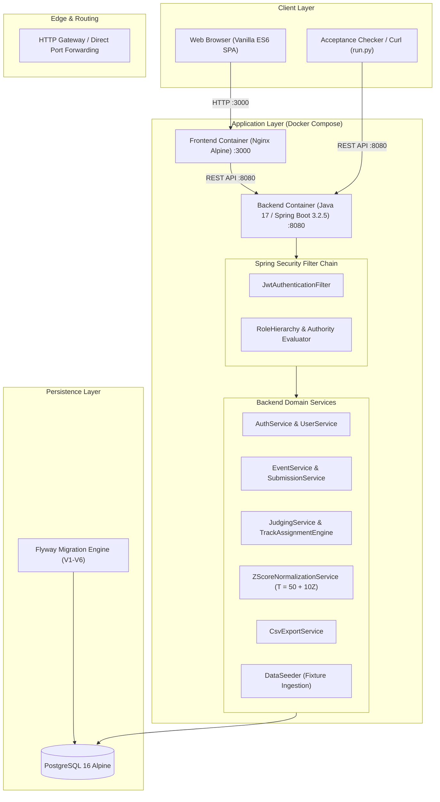
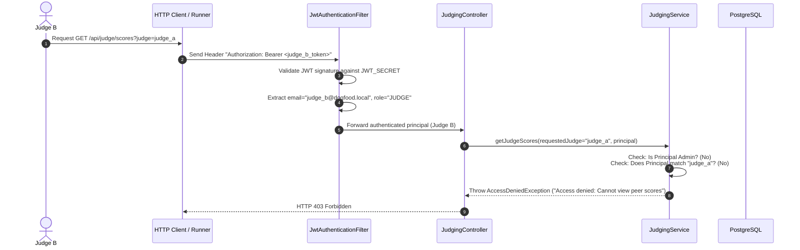
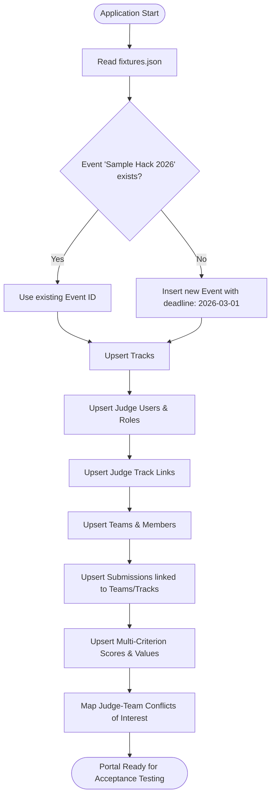

# DogFood Platform Architecture

This document provides a comprehensive technical overview of the DogFood Hackathon Management and Judging Platform architecture, component boundaries, security models, and data pipelines.

---

## 1. System Topology

---

## 2. Core Components

### 2.1 Frontend (Vanilla ES6 SPA & Nginx)
- **Architecture**: Zero-build Vanilla JavaScript Single-Page Application (SPA) using ES6 modular architecture served directly by Nginx Alpine.
- **Client-Side Routing**: `router.js` handles dynamic view mounting and deep links without server-side rendering latency.
- **Reactive State & Auth**: `authStore.js` manages client-side authentication states, JWT token storage, and event-driven UI updates.
- **Role Enforcement**: `requireRole.js` gates client-side view rendering based on user roles (`ORGANIZER`, `JUDGE`, `PARTICIPANT`).
- **Views**:
  - `landingView.js` & `galleryView.js`: Public hackathon showcase, fixture project gallery, search filters, and submission modal.
  - `submitView.js`: Submission interface with real-time deadline warnings and validation.
  - `judgeView.js`: Interactive judge portal with multi-criterion rubric scoring, personal score lists, and conflict-of-interest indicators.
  - `dashboardView.js` & `resultsView.js`: Organizer management dashboard with progress metrics, score distributions, and CSV export triggers.

### 2.2 Backend (Spring Boot 3.2.5)
- **Framework**: Java 17 and Spring Boot 3.2.5 with layered architecture (Controllers, Services, JPA Repositories, Entities).
- **Database Migrations**: Version-controlled Flyway migrations (`V1__init_schema.sql` through `V6__judge_tracks.sql`) ensure deterministic database evolution across environments.
- **Transactions**: JPA transactions (`@Transactional`) guarantee atomic score writes, conflict validations, and multi-criterion calculations.

---

## 3. Security Architecture

### 3.1 Authentication & Secrets Management
- **Stateless Tokens**: Authentication is performed via standard HMAC-SHA256 signed JSON Web Tokens (JWT) containing user subject, role authorities, and expiration claims.
- **Zero-Secret Hardcoding**: The signing secret is dynamically injected into the runtime environment via `${JWT_SECRET}`. If omitted, Docker Compose loads `.env` locally.
- **Public & Authenticated Endpoints**:
  - Public: `/api/auth/**`, `/api/events`, `/api/events/*/gallery`, `/api/events/*/submissions` (GET only).
  - Organizer Only: `/api/events/*/export/scores`, `/api/events/*/export/results`, `/api/events/*/assignments`, `/api/admin/**`.
  - Judge / Organizer: `/api/judge/**`, `/api/events/*/scores`.

### 3.2 Judge Peer Isolation & Assignment Engine
The platform implements strict backend enforcement for scoring privacy and conflict management (Tier 2 requirement):
1. **Self Score Access**: When Judge A accesses `/api/judge/scores`, the system queries only scores where `judge_id = principal.id`.
2. **Peer Score Blockade**: If Judge B attempts to query Judge A's scores via parameter `/api/judge/scores?judge=judge_a` or direct ID lookup, `JudgingService` validates that the caller has `ORGANIZER`/`ADMIN` role. If the caller is a peer judge or participant, an `AccessDeniedException` (HTTP 403 Forbidden) is immediately thrown.
3. **Track-Matched Auto-Assignment**: Organizers can trigger auto-assignment to allocate judges to submissions matching their tracks (`judge_tracks`), automatically excluding declared conflicts (`conflict_of_interests`) and team members (`team_members`).
4. **Organizer Manual Override**: Organizers can assign any judge across tracks while conflicts of interest remain strictly blocked.

---

## 4. Fixture Ingestion & Data Engine

- **Idempotency**: `DataSeeder` performs lookups prior to insertion, ensuring that multiple application restarts never create duplicate entries or corrupt relational foreign keys.
- **Relational Integrity**: String-based IDs from `fixtures.json` (e.g. `prj_01`, `jdg_01`) are mapped in-memory during seeding to generated database `BIGINT` primary keys.

---

## 5. CSV Export Pipeline

When an organizer requests `/api/events/{eventId}/export/scores` (or `/api/events/{eventId}/export/results`):
1. `JudgingService` aggregates all submissions, tracks, assigned judges, raw rubric scores, and normalized $T$-scores ($T = 50 + 10Z$).
2. `CsvExportService` constructs a standardized RFC 4180 CSV document with columns:
   `Rank, Project ID, Title, Track, Team, Raw Average, Normalized Score, Score Count, Comments`.
3. The response is returned with `Content-Type: text/csv` and valid comma-delimited headers.
