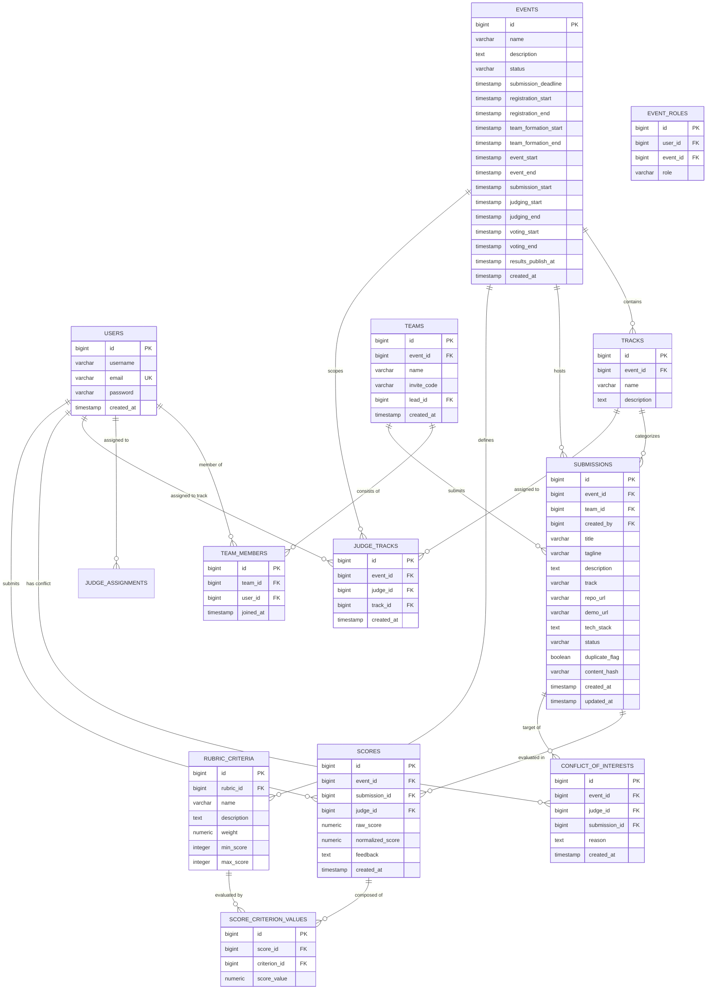

# DogFood Data Model & Relational Schema

This document details the PostgreSQL schema, entity relationships, database constraints, and Flyway migration structure for the DogFood Hackathon Platform.

---

## 1. Entity Relationship Diagram (ERD)

---

## 2. Table Specifications

### 2.1 `users` & `event_roles`
Stores platform user accounts and event-scoped roles (`ORGANIZER`, `JUDGE`, `PARTICIPANT`).
- `users`: `id` (PK, BIGINT), `username` (VARCHAR(100), Unique), `email` (VARCHAR(255), Unique), `password` (VARCHAR(255), BCrypt hash), `created_at` (TIMESTAMP).
- `event_roles`: `id` (PK, BIGINT), `user_id` (FK -> `users(id)`), `event_id` (BIGINT), `role` (VARCHAR(50), `ORGANIZER`, `JUDGE`, `PARTICIPANT`).

### 2.2 `events`
Hackathon event metadata, multi-phase lifecycle windows, and submission deadline boundaries.
- `id` (BIGINT, Primary Key, Generated)
- `name` (VARCHAR(255), Not Null)
- `description` (TEXT)
- `status` (VARCHAR(50), Not Null) - `DRAFT`, `OPEN`, `CLOSED`, `JUDGING`, `COMPLETED`
- `submission_deadline` (TIMESTAMP WITH TIME ZONE, Not Null)
- `registration_start` (TIMESTAMP WITH TIME ZONE)
- `registration_end` (TIMESTAMP WITH TIME ZONE)
- `team_formation_start` (TIMESTAMP WITH TIME ZONE)
- `team_formation_end` (TIMESTAMP WITH TIME ZONE)
- `event_start` (TIMESTAMP WITH TIME ZONE)
- `event_end` (TIMESTAMP WITH TIME ZONE)
- `submission_start` (TIMESTAMP WITH TIME ZONE)
- `judging_start` (TIMESTAMP WITH TIME ZONE)
- `judging_end` (TIMESTAMP WITH TIME ZONE)
- `voting_start` (TIMESTAMP WITH TIME ZONE)
- `voting_end` (TIMESTAMP WITH TIME ZONE)
- `results_publish_at` (TIMESTAMP WITH TIME ZONE)
- `created_at` (TIMESTAMP WITH TIME ZONE, Default CURRENT_TIMESTAMP)

### 2.3 `tracks`
Categorization tracks associated with an event.
- `id` (BIGINT, Primary Key, Generated)
- `event_id` (BIGINT, Foreign Key -> `events(id)`, On Delete Cascade)
- `name` (VARCHAR(255), Not Null)
- `description` (TEXT)

### 2.4 `judge_tracks`
Track associations for judges within an event (Flyway migration `V6__judge_tracks.sql`).
- `id` (BIGINT, Primary Key, Generated)
- `event_id` (BIGINT, Foreign Key -> `events(id)`, On Delete Cascade)
- `judge_id` (BIGINT, Foreign Key -> `users(id)`, On Delete Cascade)
- `track_id` (BIGINT, Foreign Key -> `tracks(id)`, On Delete Cascade)
- `created_at` (TIMESTAMP WITH TIME ZONE, Default CURRENT_TIMESTAMP)
- Unique Constraint: `uk_judge_track (event_id, judge_id, track_id)`

### 2.5 `teams` & `team_members`
Team definitions and participant assignments.
- `teams`: `id` (PK), `event_id` (BIGINT), `name` (VARCHAR(255), Not Null), `invite_code` (VARCHAR(64)), `lead_id` (FK -> `users(id)`), `created_at`.
- `team_members`: `id` (PK), `team_id` (FK -> `teams(id)`), `user_id` (FK -> `users(id)`), `joined_at`, Unique(`team_id`, `user_id`).

### 2.6 `submissions` & `event_custom_questions`
Project submissions entered by teams into hackathon tracks, with media and custom questions (Flyway `V7`).
- `submissions`:
  - `id` (BIGINT, Primary Key, Generated)
  - `event_id` (BIGINT, Foreign Key -> `events(id)`)
  - `team_id` (BIGINT, Foreign Key -> `teams(id)`)
  - `created_by` (BIGINT, Foreign Key -> `users(id)`)
  - `title` (VARCHAR(255), Not Null)
  - `tagline` (VARCHAR(500))
  - `description` (TEXT)
  - `track` (VARCHAR(255))
  - `repo_url` (VARCHAR(500))
  - `demo_url` (VARCHAR(500))
  - `tech_stack` (TEXT)
  - `thumbnail_url` (VARCHAR(1000))
  - `gallery_images` (TEXT, JSON array of image URLs)
  - `demo_video_url` (VARCHAR(1000))
  - `live_link` (VARCHAR(1000))
  - `custom_answers` (TEXT, JSON array of question-answer pairs)
  - `status` (VARCHAR(50)) - `DRAFT`, `SUBMITTED`, `LOCKED`
  - `duplicate_flag` (BOOLEAN, Default FALSE) - Set to true when an identical content hash or fixture duplicate is detected.
  - `content_hash` (VARCHAR(64)) - Canonical SHA-256 of lowercase whitespace-collapsed description (`SHA-256(canonical description)`), or `fixture:prj_XX` for fixture records.
  - `created_at`, `updated_at` (TIMESTAMP WITH TIME ZONE)
- `event_custom_questions`: `id` (PK), `event_id` (FK -> `events(id)`), `prompt` (TEXT), `question_type` (VARCHAR(50)), `required` (BOOLEAN), `display_order` (INT), `created_at`.

### 2.7 `rubrics` & `rubric_criteria`
Scoring criteria and relative weights defined for events.
- `rubrics`: `id` (PK), `event_id` (FK -> `events(id)`), `name` (VARCHAR(255)).
- `rubric_criteria`: `id` (PK), `rubric_id` (FK -> `rubrics(id)`), `name` (VARCHAR(255), Not Null), `description` (TEXT), `weight` (NUMERIC(5,2)), `min_score` (INTEGER), `max_score` (INTEGER).

### 2.8 `scores` & `score_criteria_values`
Evaluations submitted by judges across rubric criteria.
- `scores`: `id` (PK), `event_id` (BIGINT), `submission_id` (FK -> `submissions(id)`), `judge_id` (FK -> `users(id)`), `raw_score` (NUMERIC(6,2)), `normalized_score` (NUMERIC(6,2)), `feedback` (TEXT), `created_at`.
- `score_criteria_values`: `id` (PK), `score_id` (FK -> `scores(id)`), `criterion_id` (FK -> `rubric_criteria(id)`), `score_value` (NUMERIC(5,2)).

### 2.9 `conflict_of_interests` & `judge_assignments`
- `conflict_of_interests`: `id` (PK), `event_id` (BIGINT), `judge_id` (FK -> `users(id)`), `submission_id` (FK -> `submissions(id)`), `reason` (TEXT), `created_at`, Unique(`judge_id`, `submission_id`).
- `judge_assignments`: `id` (PK), `event_id` (BIGINT), `judge_id` (FK -> `users(id)`), `submission_id` (FK -> `submissions(id)`), `status` (VARCHAR(50)), `created_at`, Unique(`judge_id`, `submission_id`).

### 2.10 `votes`, `comments`, `webhooks`, `webhook_deliveries`, & `certificates` (T3 & T4)
- `votes`: `id` (PK), `event_id` (FK -> `events(id)`), `submission_id` (FK -> `submissions(id)`), `voter_identifier` (VARCHAR(255)), `voter_type` (VARCHAR(50) - `OPEN`, `EMAIL`, `AUTHENTICATED`), `user_id` (FK -> `users(id)`), `voter_email` (VARCHAR(255)), `ip_address` (VARCHAR(100)), `created_at`, Unique(`event_id`, `voter_identifier`).
- `comments`: `id` (PK), `event_id` (FK -> `events(id)`), `submission_id` (FK -> `submissions(id)`), `user_id` (FK -> `users(id)`), `author_name` (VARCHAR(150)), `author_email` (VARCHAR(255)), `content` (TEXT), `created_at`.
- `webhooks`: `id` (PK), `event_id` (FK -> `events(id)`), `url` (VARCHAR(1024)), `secret` (VARCHAR(255)), `events` (TEXT), `active` (BOOLEAN), `created_at`.
- `webhook_deliveries`: `id` (PK), `webhook_id` (FK -> `webhooks(id)`), `event_id` (BIGINT), `event_type` (VARCHAR(100)), `payload` (TEXT), `response_status` (INT), `response_body` (TEXT), `status` (VARCHAR(50) - `SUCCESS`, `FAILED`), `created_at`.
- `certificates`: `id` (PK), `certificate_id` (VARCHAR(100), Unique), `event_id` (FK -> `events(id)`), `recipient_id` (FK -> `users(id)`), `recipient_name` (VARCHAR(255)), `recipient_email` (VARCHAR(255)), `recipient_type` (VARCHAR(50) - `PARTICIPANT`, `JUDGE`, `WINNER`), `award_title` (VARCHAR(255)), `verification_hash` (VARCHAR(255), SHA-256), `created_at`.

---

## 3. Flyway Migration Changelog

Database versioning is managed via Spring Boot and Flyway (`backend/src/main/resources/db/migration`):

1. `V1__init_schema.sql`: Core users and event roles schema.
2. `V2__audit_log.sql`: Immutable audit log table for critical actions and security fallbacks.
3. `V3__events_tracks_teams.sql`: Events, tracks, teams, and team membership relational schema.
4. `V4__submissions_gallery.sql`: Project submissions table with URLs, tags, duplicate flags, and content hashes.
5. `V5__judging_rubric_coi.sql`: Rubrics, rubric criteria, judge assignments, score criteria values, and conflict of interest tables.
6. `V6__judge_tracks.sql`: Multi-track judge mapping table (`judge_tracks`) with foreign key constraints and indexes.
7. `V7__submission_media_and_custom_questions.sql`: Extended submission media fields (`thumbnail_url`, `gallery_images`, `demo_video_url`, `live_link`, `custom_answers`) and `event_custom_questions` table.
8. `V8__event_lifecycle_dates.sql`: Added multi-phase lifecycle timestamp columns to `events` table (`registration_start`, `registration_end`, `event_start`, `event_end`, `submission_start`, `judging_start`, `judging_end`, `results_publish_at`).
9. `V9__team_formation_and_voting_dates.sql`: Added dedicated team formation and voting lifecycle timestamp columns (`team_formation_start`, `team_formation_end`, `voting_start`, `voting_end`) to `events` table.
10. `V10__t3_t4_features.sql`: Added `voting_enabled` and `voting_access_mode` columns to `events`; created `votes`, `comments`, `webhooks`, `webhook_deliveries`, and `certificates` tables with relational indexes and integrity constraints.

---

## 4. Fixture Schema Ingestion Strategy

`fixtures.json` uses alphanumeric string identifiers (e.g., `"evt_01"`, `"trk_01"`, `"jdg_01"`, `"prj_01"`, `"prj_41"`).

To guarantee strict relational integrity without mutating production primary key sequences:
1. `DataSeeder.java` maintains transient in-memory lookup maps (`Map<String, Long>`) during ingestion.
2. When parsing fixture projects, judges, tracks, and teams, the seeder resolves database foreign keys via the lookup maps.
3. `prj_41` is ingested as a distinct submission entity with `duplicate_flag = true` and `content_hash = "fixture:prj_41"`, associated with its own 4 distinct judge scores, preserving separation from `prj_07` (5 distinct judge scores).
4. Seeder populates `judge_tracks` based on fixture judge track assignments idempotently.
5. All 8 tracks, 30 judges (39 judge-track pairings), 40 teams, 41 submissions, 126 fixture scores, and 378 fixture criteria values are seeded idempotently.
6. Subsequent server reboots query existing database entities to prevent duplicate creation.

