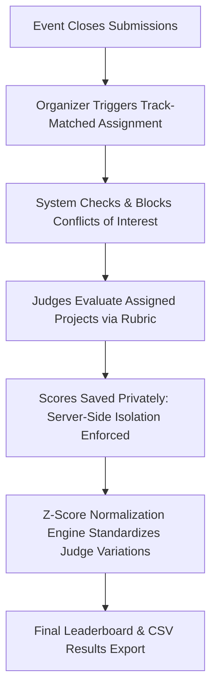

# DogFood Judging & Evaluation System

This document outlines the judging workflows, security isolation model, conflict-of-interest enforcement, rubric scoring mathematics, and normalization algorithms implemented in the DogFood platform (Tier 2).

---

## 1. Judging Workflow Overview



The judging lifecycle comprises four distinct phases:
1. **Track Assignment & Conflict Validation**: Judges are linked to specific event tracks in `judge_tracks`. When auto-assignment runs, the platform assigns judges only to projects within their matching track(s), while cross-referencing team rosters (`team_members`) and declared conflicts (`conflict_of_interests`) to eliminate bias. Organizers retain manual override capability to assign judges across tracks while conflicts remain strictly blocked.
2. **Evaluation & Scoring**: Judges review project submissions, demos, and code repositories, assigning scores across weighted rubric criteria.
3. **Strict Isolation & Privacy**: Each judge's submitted scores remain strictly private until the evaluation window concludes. Peer judges and participants are prevented from viewing another judge's scores.
4. **Normalization & Export**: The system normalizes raw scores to balance lenient vs strict graders ($T = 50 + 10Z$), producing an unbiased final leaderboard and downloadable CSV report.

---

## 2. Server-Side Judge Isolation Model

A critical requirement of Tier 2 is that **judge isolation must be enforced at the backend API layer**, not merely hidden in the user interface.

### Security Rules:
1. **Self-Score Reading**: A judge accessing `/api/judge/scores` receives only their own evaluations:
   $$\text{Filter: } \text{score.judge\_id} == \text{current\_user.id}$$
2. **Peer-Score Blockade**: When Judge B attempts to access Judge A's evaluations (`GET /api/judge/scores?judge=judge_a` or `/api/events/{id}/scores?judge=judge_a`), `JudgingService` verifies whether the requesting principal possesses `ADMIN` or `ORGANIZER` authority. If the principal is another judge or a participant, the request is terminated with **HTTP 403 Forbidden**.
3. **Participant Access**: All requests from `PARTICIPANT` role accounts to judge score endpoints return **HTTP 403 Forbidden**.

---

## 3. Conflict of Interest (COI) Prevention & Judge Assignment

### 3.1 Conflict Rules
A judge is strictly prohibited from evaluating a project if:
1. **Team Membership Conflict**: The judge is a member of the submitting team in `team_members` (`teamMemberRepository.existsByTeamIdAndUserId`).
2. **Declared Conflict**: The judge has a declared conflict of interest in `conflict_of_interests` (`coiRepository.existsByJudgeIdAndSubmissionId`).

When a conflicted judge attempts to submit scores via `POST /api/events/{eventId}/scores`, the backend validates the assignment matrix and rejects the transaction with `403 Forbidden` (`"Conflict of interest: You cannot score this project"`).

### 3.2 Track-Matched Automatic Assignment
Organizers trigger automatic assignment via `POST /api/events/{eventId}/assignments` with `{"autoAssign": true}`:
- **Track Resolution**: The system resolves each submission's track name to its `Track` entity and retrieves judges assigned to that track via `judge_tracks` (`judgeTrackRepository.findByEventIdAndTrackId`).
- **Conflict Filtering**: For each candidate judge, the system verifies that no declared COI exists and the judge is not a team member of the submission's team.
- **Fallback Behavior**: If an event has no track-specific judge assignments configured, the system falls back to the event-wide judge pool.
- **Idempotency**: Existing assignments are preserved without creating duplicate records on repeat runs.

### 3.3 Organizer Manual Override
Organizers can manually assign any judge to any submission via `POST /api/events/{eventId}/assignments` with `{"judgeId": <id>, "submissionId": <id>}`:
- Allows cross-track assignments when organizer discretion is required.
- **Strict Conflict Gate**: Manual assignment strictly verifies declared COIs and team memberships; if a conflict exists, the API throws `400 Bad Request` (`IllegalArgumentException`) and blocks the assignment.

---

## 4. Weighted Rubric Scoring

Each event defines custom scoring criteria with configurable weights and integer ranges:

$$\text{Project Raw Score} = \frac{\sum_{k=1}^{K} w_k \cdot s_{ik}}{\sum_{k=1}^{K} w_k}$$

Where:
- $K$ is the number of rubric criteria (e.g., *Functionality*, *Technical Depth*, *Design*).
- $w_k$ is the weight of criterion $k$.
- $s_{ik}$ is the score assigned to criterion $k$ by judge $i$ ($s_{ik} \in [\text{min\_score}, \text{max\_score}]$).

---

## 5. Score Normalization Engine

### 5.1 The Problem: Judge Variance & Scale Distortion
In multi-judge hackathons, uncalibrated grading introduces two primary forms of bias:
- **Leniency / Severity Bias**: Judge A assigns scores between 4.0 and 5.0 ($\mu_A = 4.5$), while Judge B assigns scores between 1.0 and 3.0 ($\mu_B = 2.0$).
- **Spread Bias**: Judge C gives only 3s and 4s ($\sigma_C \approx 0.5$), while Judge D uses the entire 1–5 range ($\sigma_D \approx 1.5$).

### 5.2 Z-Score Normalization Algorithm & Formula
To eliminate bias, `ZScoreNormalizationService` computes standard $Z$-scores per judge before transforming them into standardized $T$-scores:

1. **Calculate Judge Mean ($\mu_i$) and Sample Standard Deviation ($\sigma_i$)**:
   $$\mu_i = \frac{1}{N_i} \sum_{j=1}^{N_i} S_{ij}$$
   $$\sigma_i = \sqrt{\frac{1}{N_i - 1} \sum_{j=1}^{N_i} (S_{ij} - \mu_i)^2}$$
   Where $N_i$ is the number of submissions evaluated by judge $i$, and $S_{ij}$ is the raw score given by judge $i$ to project $j$.

2. **Compute Standardized $T$-Score ($T_{ij}$)**:
   For judges with positive variance ($\sigma_i \ge 0.0001$):
   $$Z_{ij} = \frac{S_{ij} - \mu_i}{\sigma_i}$$
   $$T_{ij} = 50.0 + 10.0 \cdot Z_{ij}$$

3. **Zero-Variance Fallback Rule ($T_{\text{flat}} = 50.0$)**:
   When a judge assigns identical scores to all evaluated projects ($\sigma_i < 0.0001$) or evaluates only a single project ($N_i \le 1$), the judge provides zero differentiating signal. The standardized score assigned to every project evaluated by this judge is strictly the neutral $T$-score:
   $$Z_{ij} = 0.0 \implies T_{\text{flat}} = 50.0$$
   *Note*: The platform explicitly chooses $T_{\text{flat}} = 50.0$ (neutral $Z=0$ on the $T$-scale) over raw global-mean substitution to prevent scale-mixing distortions.

4. **Aggregate Project Score**:
   $$\text{Final Project Score}_j = \frac{1}{M_j} \sum_{i=1}^{M_j} T_{ij}$$
   Where $M_j$ is the number of judges who reviewed project $j$.

---

### 5.3 Worked Example: Three Judges with One Flat Judge

Consider a hackathon with 3 projects (A, B, C) evaluated on a $1\text{--}5$ point scale by 3 judges:

- **Judge 1 (Strict Judge)**:
  - Scores: Project A = $3.0$, Project B = $2.0$, Project C = $1.0$
  - $\mu_1 = 2.00$, $\sigma_1 = 1.00$
  - Project A: $Z_{1A} = \frac{3.0 - 2.0}{1.0} = +1.00 \implies T_{1A} = 50.0 + 10.0(1.00) = \mathbf{60.00}$
- **Judge 2 (Lenient Judge)**:
  - Scores: Project A = $5.0$, Project B = $4.0$, Project C = $3.0$
  - $\mu_2 = 4.00$, $\sigma_2 = 1.00$
  - Project A: $Z_{2A} = \frac{5.0 - 4.0}{1.0} = +1.00 \implies T_{2A} = 50.0 + 10.0(1.00) = \mathbf{60.00}$
- **Judge 3 (Flat Judge)**:
  - Scores: Project A = $4.0$, Project B = $4.0$, Project C = $4.0$
  - $\mu_3 = 4.00$, $\sigma_3 = 0.00$ ($\sigma_3 < 0.0001 \implies$ Flat Judge Fallback: $T_{3A} = \mathbf{50.00}$)

#### Overall Global Raw Mean Calculation:
Across all 9 evaluations, the sum of raw scores is $(3.0 + 2.0 + 1.0) + (5.0 + 4.0 + 3.0) + (4.0 + 4.0 + 4.0) = 30.00$.
$$\mu_{\text{global}} = \frac{30.00}{9} = 3.\bar{3} \approx 3.33$$

#### Comparing Normalization Outcomes for Project A:
- **With Implemented $T_{\text{flat}} = 50.0$ Fallback (Chosen Rule)**:
  $$\text{Final Score}(A) = \frac{T_{1A} + T_{2A} + T_{3A}}{3} = \frac{60.00 + 60.00 + 50.00}{3} = \frac{170.00}{3} \approx \mathbf{56.67}$$
  *Result*: Project A is recognized as above average ($+0.67\sigma$), appropriately reflecting that every discerning judge rated it as their top project.
- **With Discarded Raw Global-Mean Substitution**:
  $$\text{Distorted Score}(A) = \frac{60.00 + 60.00 + 3.33}{3} = \frac{123.33}{3} \approx \mathbf{41.11}$$
  *Result*: Mixing a raw point score ($3.33$) into $T$-scores ($60.0$) artificially degraded Project A to $-0.89\sigma$ below average.

---

## 6. CSV Results Export

Organizers and administrators can generate an official CSV export via `GET /api/events/{eventId}/export/scores`.

### CSV Export Format (RFC 4180 compliant):
```csv
Rank,Project ID,Title,Track,Team,Raw Average,Normalized Score,Score Count,Comments
1,1,Quiet Hours,Developer tools,Nightshift,4.50,65.00,3,"Clean implementation; Great UX"
2,2,DataPulse,Security,PulseCore,4.20,62.00,2,"Innovative architecture"
```

The CSV export is strictly protected by `@PreAuthorize("hasAnyRole('ORGANIZER', 'ADMIN')")`.

---

## 7. Acceptance & Verification Scope

The DogFood verification strategy distinguishes between official black-box acceptance and white-box system testing:

1. **Official Acceptance Suite (`run.py`)**:
   - The unmodified 7-check organizer script tests core Tier 1 (public gallery, fixture presence, deadline submission rejection) and Tier 2 (judge self-scores, peer score isolation, participant score blockade, and CSV export).
   - *Honest Disclosure*: `run.py` does not test mathematical $Z$-score normalization curves or track-matched auto-assignment algorithms.
2. **Java Test Suite (42 Tests)**:
   - Evaluates full system logic including `ZScoreNormalizationServiceTest` (zero-variance fallback and scale-mixing prevention), `TrackMatchedJudgeAssignmentTest` (track matching, non-matching exclusion, COI exclusion, idempotency, manual cross-track overrides), and `JudgingSecurityTest` (RBAC and authorization gates).
3. **Live Database Verification**:
   - Track matching and COI enforcement are verified directly against clean PostgreSQL instances with Flyway migrations `V1`–`V6`.
