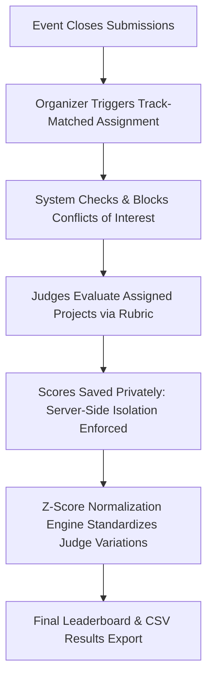

# DogFood Judging & Evaluation System

This document outlines the judging workflows, security isolation model, conflict-of-interest enforcement, rubric scoring mathematics, and normalization algorithms implemented in the DogFood platform (Tier 2).

---

## 1. Judging Workflow Overview



The judging lifecycle comprises four distinct phases:
1. **Track Assignment & Conflict Validation**: Judges are linked to specific event tracks in `judge_tracks`. When auto-assignment runs, the platform assigns judges only to projects within their matching track(s), while cross-referencing team rosters (`team_members`) and declared conflicts (`conflict_of_interests`) to eliminate bias. Organizers retain manual override capability to assign judges across tracks while conflicts remain strictly blocked.
2. **Evaluation & Scoring**: Judges review project submissions, demos, and code repositories, assigning scores across weighted rubric criteria.
3. **Strict Isolation & Privacy**: Each judge's submitted scores remain strictly private until the evaluation window concludes. Peer judges and participants are prevented from viewing another judge's scores.
4. **Normalization & Export**: The system normalizes raw scores to balance lenient vs strict graders ($T = 50 + 10Z$), producing an unbiased final leaderboard and downloadable CSV report.

---

## 2. Server-Side Judge Isolation Model

A critical requirement of Tier 2 is that **judge isolation must be enforced at the backend API layer**, not merely hidden in the user interface.

### Security Rules:
1. **Self-Score Reading**: A judge accessing `/api/judge/scores` receives only their own evaluations:
   $$\text{Filter: } \text{score.judge\_id} == \text{current\_user.id}$$
2. **Peer-Score Blockade**: When Judge B attempts to access Judge A's evaluations (`GET /api/judge/scores?judge=judge_a` or `/api/events/{id}/scores?judge=judge_a`), `JudgingService` verifies whether the requesting principal possesses `ADMIN` or `ORGANIZER` authority. If the principal is another judge or a participant, the request is terminated with **HTTP 403 Forbidden**.
3. **Participant Access**: All requests from `PARTICIPANT` role accounts to judge score endpoints return **HTTP 403 Forbidden**.

---

## 3. Conflict of Interest (COI) Prevention & Judge Assignment

### 3.1 Conflict Rules
A judge is strictly prohibited from evaluating a project if:
1. **Team Membership Conflict**: The judge is a member of the submitting team in `team_members` (`teamMemberRepository.existsByTeamIdAndUserId`).
2. **Declared Conflict**: The judge has a declared conflict of interest in `conflict_of_interests` (`coiRepository.existsByJudgeIdAndSubmissionId`).

When a conflicted judge attempts to submit scores via `POST /api/events/{eventId}/scores`, the backend validates the assignment matrix and rejects the transaction with `403 Forbidden` (`"Conflict of interest: You cannot score this project"`).

### 3.2 Track-Matched Automatic Assignment
Organizers trigger automatic assignment via `POST /api/events/{eventId}/assignments` with `{"autoAssign": true}`:
- **Track Resolution**: The system resolves each submission's track name to its `Track` entity and retrieves judges assigned to that track via `judge_tracks` (`judgeTrackRepository.findByEventIdAndTrackId`).
- **Conflict Filtering**: For each candidate judge, the system verifies that no declared COI exists and the judge is not a team member of the submission's team.
- **Fallback Behavior**: If an event has no track-specific judge assignments configured, the system falls back to the event-wide judge pool.
- **Idempotency**: Existing assignments are preserved without creating duplicate records on repeat runs.

### 3.3 Organizer Manual Override
Organizers can manually assign any judge to any submission via `POST /api/events/{eventId}/assignments` with `{"judgeId": <id>, "submissionId": <id>}`:
- Allows cross-track assignments when organizer discretion is required.
- **Strict Conflict Gate**: Manual assignment strictly verifies declared COIs and team memberships; if a conflict exists, the API throws `400 Bad Request` (`IllegalArgumentException`) and blocks the assignment.

---

## 4. Weighted Rubric Scoring

Each event defines custom scoring criteria with configurable weights and integer ranges:

$$\text{Project Raw Score} = \frac{\sum_{k=1}^{K} w_k \cdot s_{ik}}{\sum_{k=1}^{K} w_k}$$

Where:
- $K$ is the number of rubric criteria (e.g., *Functionality*, *Technical Depth*, *Design*).
- $w_k$ is the weight of criterion $k$.
- $s_{ik}$ is the score assigned to criterion $k$ by judge $i$ ($s_{ik} \in [\text{min\_score}, \text{max\_score}]$).

---

## 5. Score Normalization Engine

### 5.1 The Problem: Judge Variance & Scale Distortion
In multi-judge hackathons, uncalibrated grading introduces two primary forms of bias:
- **Leniency / Severity Bias**: Judge A assigns scores between 4.0 and 5.0 ($\mu_A = 4.5$), while Judge B assigns scores between 1.0 and 3.0 ($\mu_B = 2.0$).
- **Spread Bias**: Judge C gives only 3s and 4s ($\sigma_C \approx 0.5$), while Judge D uses the entire 1–5 range ($\sigma_D \approx 1.5$).

### 5.2 Z-Score Normalization Algorithm & Formula
To eliminate bias, `ZScoreNormalizationService` computes standard $Z$-scores per judge before transforming them into standardized $T$-scores:

1. **Calculate Judge Mean ($\mu_i$) and Sample Standard Deviation ($\sigma_i$)**:
   $$\mu_i = \frac{1}{N_i} \sum_{j=1}^{N_i} S_{ij}$$
   $$\sigma_i = \sqrt{\frac{1}{N_i - 1} \sum_{j=1}^{N_i} (S_{ij} - \mu_i)^2}$$
   Where $N_i$ is the number of submissions evaluated by judge $i$, and $S_{ij}$ is the raw score given by judge $i$ to project $j$.

2. **Compute Standardized $T$-Score ($T_{ij}$)**:
   For judges with positive variance ($\sigma_i \ge 0.0001$):
   $$Z_{ij} = \frac{S_{ij} - \mu_i}{\sigma_i}$$
   $$T_{ij} = 50.0 + 10.0 \cdot Z_{ij}$$

3. **Zero-Variance Fallback Rule ($T_{\text{flat}} = 50.0$)**:
   When a judge assigns identical scores to all evaluated projects ($\sigma_i < 0.0001$) or evaluates only a single project ($N_i \le 1$), the judge provides zero differentiating signal. The standardized score assigned to every project evaluated by this judge is strictly the neutral $T$-score:
   $$Z_{ij} = 0.0 \implies T_{\text{flat}} = 50.0$$
   *Note*: The platform explicitly chooses $T_{\text{flat}} = 50.0$ (neutral $Z=0$ on the $T$-scale) over raw global-mean substitution to prevent scale-mixing distortions.

4. **Aggregate Project Score**:
   $$\text{Final Project Score}_j = \frac{1}{M_j} \sum_{i=1}^{M_j} T_{ij}$$
   Where $M_j$ is the number of judges who reviewed project $j$.

---

### 5.3 Worked Example: Three Judges with One Flat Judge

Consider a hackathon with 3 projects (A, B, C) evaluated on a $1\text{--}5$ point scale by 3 judges:

- **Judge 1 (Strict Judge)**:
  - Scores: Project A = $3.0$, Project B = $2.0$, Project C = $1.0$
  - $\mu_1 = 2.00$, $\sigma_1 = 1.00$
  - Project A: $Z_{1A} = \frac{3.0 - 2.0}{1.0} = +1.00 \implies T_{1A} = 50.0 + 10.0(1.00) = \mathbf{60.00}$
- **Judge 2 (Lenient Judge)**:
  - Scores: Project A = $5.0$, Project B = $4.0$, Project C = $3.0$
  - $\mu_2 = 4.00$, $\sigma_2 = 1.00$
  - Project A: $Z_{2A} = \frac{5.0 - 4.0}{1.0} = +1.00 \implies T_{2A} = 50.0 + 10.0(1.00) = \mathbf{60.00}$
- **Judge 3 (Flat Judge)**:
  - Scores: Project A = $4.0$, Project B = $4.0$, Project C = $4.0$
  - $\mu_3 = 4.00$, $\sigma_3 = 0.00$ ($\sigma_3 < 0.0001 \implies$ Flat Judge Fallback: $T_{3A} = \mathbf{50.00}$)

#### Overall Global Raw Mean Calculation:
Across all 9 evaluations, the sum of raw scores is $(3.0 + 2.0 + 1.0) + (5.0 + 4.0 + 3.0) + (4.0 + 4.0 + 4.0) = 30.00$.
$$\mu_{\text{global}} = \frac{30.00}{9} = 3.\bar{3} \approx 3.33$$

#### Comparing Normalization Outcomes for Project A:
- **With Implemented $T_{\text{flat}} = 50.0$ Fallback (Chosen Rule)**:
  $$\text{Final Score}(A) = \frac{T_{1A} + T_{2A} + T_{3A}}{3} = \frac{60.00 + 60.00 + 50.00}{3} = \frac{170.00}{3} \approx \mathbf{56.67}$$
  *Result*: Project A is recognized as above average ($+0.67\sigma$), appropriately reflecting that every discerning judge rated it as their top project.
- **With Discarded Raw Global-Mean Substitution**:
  $$\text{Distorted Score}(A) = \frac{60.00 + 60.00 + 3.33}{3} = \frac{123.33}{3} \approx \mathbf{41.11}$$
  *Result*: Mixing a raw point score ($3.33$) into $T$-scores ($60.0$) artificially degraded Project A to $-0.89\sigma$ below average.

---

## 6. CSV Results Export

Organizers and administrators can generate an official CSV export via `GET /api/events/{eventId}/export/scores`.

### CSV Export Format (RFC 4180 compliant):
```csv
Rank,Project ID,Title,Track,Team,Raw Average,Normalized Score,Score Count,Comments
1,1,Quiet Hours,Developer tools,Nightshift,4.50,65.00,3,"Clean implementation; Great UX"
2,2,DataPulse,Security,PulseCore,4.20,62.00,2,"Innovative architecture"
```

The CSV export is strictly protected by `@PreAuthorize("hasAnyRole('ORGANIZER', 'ADMIN')")`.

---

## 7. Operational Dashboards: Coverage & Workload Balancing

To give organizers real-time visibility into the judging process without exposing sensitive individual ratings:

### 7.1 Judge Coverage Dashboard (`GET /api/events/{eventId}/judging/coverage`)
Monitors the review saturation of every project relative to the target review count (default: 3 reviews per project):
- **Fully Covered ($3/3 \checkmark$)**: Green status pill indicating project has achieved its target evaluation quota.
- **Partially Covered ($1/3$ or $2/3 \triangle$)**: Yellow status pill indicating active reviews in progress or queue deficits.
- **Unassigned / Zero Reviews ($0/3 \times$)**: Red status pill highlighting at-risk submissions needing organizer attention.
- Features real-time track and project search filtering.

### 7.2 Judge Workload Balancing Dashboard (`GET /api/events/{eventId}/judging/workload`)
Visualizes judge capacity and completion velocity across the event:
- Tracks `assignedCount`, `completedCount`, `remainingCount`, and `completionPercentage` per judge.
- Color-coded progress bars (Green $\ge 100\%$, Blue $\ge 50\%$, Yellow $< 50\%$, Gray $= 0\%$).
- Displays active judge status pills (`DONE`, `IN PROGRESS`, `PENDING`).

### 7.3 Enhanced Auto-Assignment Reporting
When organizers trigger auto-assignment (`POST /api/events/{eventId}/assignments` with `autoAssign: true`), the response returns comprehensive operational telemetry:
- `projectsFullyCovered`: Count of submissions meeting target quota.
- `projectsUnderCovered`: Count of submissions below target quota due to pool exhaustion.
- `assignmentsSkipped`: Count of assignments avoided due to conflict of interest or track mismatch.
- `skipReasons`: Explanatory log detailing why specific pairings were skipped.

---

## 8. Scoring Health & Anomaly Monitoring

### 8.1 Organizer Scoring Health View (`GET /api/events/{eventId}/judging/scoring-health`)
Provides event directors with high-level statistical health indicators:
- `overallCompletionRate`: Event-wide ratio of submitted reviews against required review quota.
- `projectsZeroReviews`, `projectsSingleReview`, `projectsFullyReviewed`: Submissions broken down by completion tier.
- `judgeStats`: Per-judge statistics including sample mean ($\mu_i$), sample standard deviation ($\sigma_i$), and queue completion flag.

### 8.2 Strict Privacy & Zero Peer Score Leakage
- **No Peer Exposure**: The scoring health endpoint is strictly gated by `@PreAuthorize("hasAnyRole('ORGANIZER', 'ADMIN')")`. Judges requesting this endpoint receive `403 Forbidden`.
- **Anonymized Deliberation**: Individual judge criteria ratings and qualitative comments are never disclosed to peer judges or public viewers.

---

## 9. Mathematical Reproducibility & Normalization Proof

To build absolute trust in hackathon outcomes, organizers can audit the exact mathematical transformation via:
`GET /api/events/{eventId}/judging/normalization-proof`

### 9.1 Reproducible Proof Report
The endpoint returns:
- `formula`: Canonical equation $T = 50 + 10 \cdot Z$ where $Z = \frac{X - \mu}{\sigma}$.
- `zeroVarianceFallbackRule`: Formal declaration that when $\sigma = 0$ or $N \le 1$, $Z \equiv 0 \implies T = 50.0$.
- `judgeDistributions`: Exact calculated values for $\mu_i$, $\sigma_i$, evaluation count $N_i$, and applied method.
- `projectCalculations`: Step-by-step breakdown for each submission including per-judge raw score, judge mean/std dev, computed $Z$-score, computed $T$-score, and resulting rank shift ($\Delta$).

### 9.2 Interactive Dashboard Proof Modal
Organizers can click **"Inspect Mathematical Normalization Proof"** in the Command Center to open an interactive modal displaying the verified judge parameters and per-project calculation derivations in real time.

---

## 10. Acceptance & Verification Scope

The DogFood verification strategy distinguishes between official black-box acceptance and white-box system testing:

1. **T1 & T2 Hardening & Integrity Suite (`tests/t1-t2-hardening-suite.py`)**:
   - Validates submission readiness pre-flight checks, judge coverage metrics, judge workload balancing, organizer scoring health telemetry, normalization analysis, and reproducible proof verification.
   - Enforces role isolation (ensuring judges and visitors are blocked from scoring-health and normalization APIs).
2. **Submission Lifecycle Verification Suite (`tests/submission-lifecycle-test.py`)**:
   - 11-step mandatory test verifying draft creation, submission, public gallery visibility, pre-deadline versioned edits ($v1 \to v2$), and strict deadline rejection ($409$).
3. **T3 & T4 Full System Verification Suite (`tests/t3-t4-verification-suite.py`)**:
   - 52-step end-to-end verification covering triple-mode voting, rate-limiting, HMAC-SHA256 judge record verification, certificate authority ledger, bulk data migration, and audit trail logging.
4. **Frontend Truthfulness Test Suite (`frontend/tests/truthfulness.test.mjs`)**:
   - 42-step headless browser and route test suite confirming RBAC guards, truthful status rendering, zero mock data, and dynamic deadline countdown UX.
5. **Pairwise Judging & Bradley-Terry Verification Suite (`tests/pairwise-judging-test.py`)**:
   - 51-step end-to-end suite verifying mode toggle, heuristic pair selection, zero-leakage peer isolation, duplicate rejection (409), winner validation, Bradley-Terry MM convergence, coverage telemetry, deliberation protection, RFC 4180 CSV export, and audit trails.

---

## 11. Bonus Challenge: Pairwise Judging Mode & Bradley-Terry Engine (+5)

### 11.1 Architectural Overview
The platform introduces **Pairwise Judging Mode** as an organizer-configurable alternative or complementary judging modality:
- **Organizer Toggle**: Configurable per-event via `POST /api/events/{id}/pairwise/toggle` (`pairwise_judging_enabled`).
- **Duel Experience**: Judges compare exactly TWO eligible projects side-by-side (`[ Project A is Better ]` vs `[ Project B is Better ]`) with keyboard shortcuts (`A`/`Left Arrow` for Project A, `B`/`Right Arrow` for Project B, `S` for Skip) and comparative rationale notes.
- **Queue Transition**: Submitting or skipping a duel automatically advances to the next pair with instant state updates.

### 11.2 Bounded Smart Pair Generation
Candidate pair selection prioritizes graph coverage while bounding combinatorial expansion:
1. **Underrepresented Project Prioritization**: Projects with the fewest total comparisons across the event are prioritized to ensure uniform connectivity.
2. **Novel Pair Selection**: Matchups not yet evaluated by ANY judge are prioritized to maximize the number of unique edges in the comparison graph.
3. **Bounded Candidate Pool ($K \le 40$)**: Rather than generating all $O(N^2)$ pairs across large submission tables, candidate generation evaluates the $K$ least-evaluated submissions, preventing heap memory exhaustion and providing microsecond response times.
4. **COI & Track Enforcement**: Matchups automatically exclude projects where the judge has a declared COI or team membership, and filter by assigned track when configured.

### 11.3 Relational Integrity & Duplicate Rejection
- **Canonical Ordering**: Pairs are strictly persisted with $p_A < p_B$ enforced via DB check constraint `chk_canonical_pair CHECK (project_a_id < project_b_id)`.
- **Duplicate Prevention**: A unique constraint `uk_judge_event_pair (judge_id, event_id, project_a_id, project_b_id)` guarantees that a judge cannot evaluate the same pair twice. Reversed submissions $(B, A)$ are canonicalized to $(A, B)$ and rejected with **HTTP 409 Conflict**.
- **Winner Validation**: The submitted `winnerProjectId` must strictly equal either `projectAId` or `projectBId`; otherwise rejected with **HTTP 400 Bad Request**.

### 11.4 Peer Privacy & Zero-Leakage Guarantee
- **No Score Exposure**: The pairwise payload never discloses numeric scores, normalized scores, rubric ratings, or prior judge comments.
- **Isolated History**: A judge requesting `/api/events/{id}/judging/pairwise/history` receives only their own comparisons. Requesting a peer judge's comparison stream is rejected with **HTTP 403 Forbidden**.
- **Deliberation Protection**: Pairwise rankings are strictly hidden from participants and visitors until `resultsPublishAt` (HTTP 403/401).

### 11.5 Bradley-Terry Minorization-Maximization (MM) Algorithm
Latent project strengths $s_i > 0$ are recovered using the Bradley-Terry probabilistic model:

$$P(i \succ j) = \frac{s_i}{s_i + s_j}$$

1. **Log-Likelihood with Bayesian Smoothing Prior ($\alpha = 0.05$)**:
   To prevent division by zero or divergence on sparse/disconnected graphs, regularized MM updates iteratively compute:
   $$s_i^{(t+1)} = \frac{w_i + \alpha}{\sum_{j \ne i} \frac{n_{ij}}{s_i^{(t)} + s_j^{(t)}} + \alpha}$$
   Where $w_i$ is the total wins of project $i$, and $n_{ij} = w_{ij} + w_{ji}$ is the total comparisons between $i$ and $j$.

2. **Scale Normalization**:
   At each iteration, strengths are normalized to an average latent strength of $1.000$:
   $$s_i \leftarrow s_i \cdot \frac{N}{\sum_{k=1}^N s_k}$$

3. **Convergence Criterion**:
   Iterations continue until maximum parameter shift drops below $\epsilon = 10^{-6}$ or 100 iterations:
   $$\max_{i} |s_i^{(t+1)} - s_i^{(t)}| < 10^{-6}$$

4. **Graph Connectivity Detection (BFS)**:
   The comparison graph is evaluated for connected components:
   - If disconnected ($C > 1$ components): Status is reported as `INSUFFICIENT_COVERAGE`, warning organizers that rankings are preliminary because comparisons span disconnected components.
   - If connected ($C = 1$ and unique pairs $\ge N - 1$): Status is reported as `CONVERGED`.

### 11.6 Organizer Coverage Dashboard & RFC 4180 CSV Export
- **Coverage Telemetry (`/api/events/{id}/judging/pairwise/coverage`)**: Reports total projects, total possible pairs $N(N-1)/2$, unique pairs compared, coverage %, participating judges, disconnected components, and health status (`EXCELLENT`, `MODERATE`, `INSUFFICIENT`).
- **RFC 4180 CSV Export (`/api/events/{id}/export/pairwise`)**: Generates audit-ready CSV exports including `Event ID, Track, Rank, Project ID, Title, Comparisons, Wins, Losses, Win Rate (%), Bradley-Terry Strength`. Restricted to organizers and admins (HTTP 403 for participants).
- **Audit Logging**: All mode toggles, comparison submissions, duplicate rejections, and ranking evaluations are recorded immutably in the event audit log.


