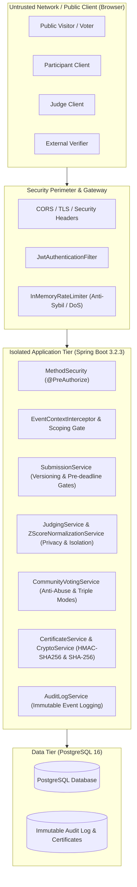

# DogFood Security Architecture & Threat Model

This document specifies the security architecture, threat model, trust boundaries, attack vectors, mitigation strategies, and residual risks for the DogFood Hackathon Platform.

---

## 1. System Architecture & Trust Boundaries

### Trust Boundary Definitions:
1. **Public Visitor vs. System**: Visitors have zero privileges beyond public discovery (galleries, approved public results, public voting ballots when open, certificate verification, and judge record verification).
2. **Participant vs. Organizer**: Participants can manage their own team, create drafts, and edit submissions *only before* the event deadline. They cannot view unreleased scores, peer drafts, or administrative endpoints.
3. **Judge vs. Judge (Peer Isolation)**: A judge is an evaluator whose evaluations, notes, and rubric scores are strictly private. Judges are explicitly blocked from viewing peer evaluations to prevent anchoring bias or collusion.
4. **Judge vs. Organizer**: Judges only have access to their assigned evaluation queue and self-scores. Organizers hold event-wide governance authority, managing tracks, rubric definitions, assignment balancing, scoring health, normalization analysis, and audit trails.
5. **Cross-Event Boundaries**: Authority granted within Event $A$ does not grant authority in Event $B$.

---

## 2. Threat Vector Analysis & Mitigation Matrix

| Threat Category | Specific Attack Vector | Severity | Mitigation Strategy | Enforcement Mechanism |
| :--- | :--- | :--- | :--- | :--- |
| **Authentication & RBAC** | Role Spoofing via Client Payload | CRITICAL | Signup endpoint accepts strictly `{ username, email, password }`. Roles are assigned exclusively via database seed or verified organizer event invitation. | Server-side DTO sanitization & Spring Security context. |
| **Peer Score Privacy** | Judge Score Leakage & Anchoring Bias | CRITICAL | Scores are partitioned per judge. An endpoint reading scores enforces `judge_id == principal.id`. Organizers can view aggregated metrics, but judges are blocked from peer scores. | `JudgingService` ownership checks; `403 Forbidden` returned on peer access attempt. |
| **Judging Integrity** | Conflict of Interest (COI) Evasion | HIGH | Strict verification that judges cannot be assigned to or score projects submitted by their own team or for which a COI was declared. | Database unique constraints on `conflict_of_interests`; backend checks on auto-assign, manual assign, and `POST /scores`. |
| **Submission Integrity** | Post-Deadline Tampering & Overwrites | HIGH | Edit attempts check `event.submissionDeadline` against `Instant.now()`. Post-deadline updates are rejected. Submission edits increment `version_number` and record `updated_by`. | `SubmissionService.updateSubmission` timestamp validation; Flyway V12 versioning table. |
| **Sybil Attack (Voting)** | Automated Ballot Stuffing & Duplicate Votes | HIGH | Triple-mode voting (OPEN, EMAIL, AUTHENTICATED). Rate-limiting per IP/token, email normalization, single vote constraint per event. | `InMemoryRateLimiter` (429 Too Many Requests), unique DB index on `(event_id, voter_identifier)`. |
| **Credential & Award Forgery** | Fake Participant or Winner Certificates | MEDIUM | Every certificate is stamped with a unique alphanumeric ID and canonical SHA-256 verification hash over recipient, event, and award details. | `CertificateService` verification endpoint `/api/certificates/verify/{id}` cross-referenced against DB. |
| **Judge Record Tampering** | Falsifying Judge Participation Record | HIGH | Judge participation records are cryptographically signed using HMAC-SHA256 with an HMAC secret key. Does not disclose private scores. | `CryptoService.verifyHmacSha256`; public verification rejects mismatched payloads with visual invalid status. |
| **Resource Exhaustion (DoS)** | Heap Exhaustion via Massive Bulk Import/Export | HIGH | Memory-safe bounded processing: Exports bounded to 200 items per batch; imports partitioned to batches of 100 with transactional flush. | `BulkDataService` stream batching; pre-allocated buffers. |
| **Cross-Event Leakage** | Event Token Replay & Horizontal Escalation | HIGH | API client and backend controller require `eventId` path parameters. Access checks verify event-specific role assignment. | `EventContextInterceptor`, `EventRoleRepository.existsByUserIdAndEventIdAndRole`. |

---

## 3. Cryptographic Implementation Details

### 3.1 HMAC-SHA256 Signed Judge Participation Records (T4)
To enable external verification of a judge's contribution without leaking confidential evaluation data (scores, rubric criteria values, private comments):
- **Canonical Payload Structure**:
  $$\text{Payload} = \text{judgeId} + \text{":"} + \text{eventId} + \text{":"} + \text{evaluatedCount} + \text{":"} + \text{timestamp}$$
- **Signature Generation**:
  $$\text{Signature} = \text{Hex}(\text{HMAC-SHA256}(K_{\text{judge}}, \text{Payload}))$$
- **Verification Rule**:
  External verifiers submit the claim $(\text{judgeId}, \text{eventId}, \text{evaluatedCount}, \text{timestamp}, \text{Signature})$. The server reconstructs the canonical message, recomputes the HMAC using the server-side signing key, and compares using a constant-time equality check (`MessageDigest.isEqual`) to thwart timing attacks.

### 3.2 Certificate Integrity (SHA-256)
- **Hash Pre-image**:
  $$\text{Checksum} = \text{SHA-256}(\text{certificateId} \parallel \text{eventId} \parallel \text{recipientId} \parallel \text{recipientName} \parallel \text{awardTitle} \parallel \text{createdAt})$$
- Ensures certificates cannot be modified in the database or transit without invalidating the cryptographic checksum.

---

## 4. Normalization Transparency & Mathematical Invariants

In subjective peer and panel evaluations, score manipulation can occur through collusion or extreme scoring. DogFood implements $Z$-score standardized $T$-score normalization:
- **Normalization Formula**:
  $$T_{ij} = 50.0 + 10.0 \cdot \left(\frac{S_{ij} - \mu_i}{\sigma_i}\right)$$
- **Zero-Variance Invariant**:
  When a judge evaluates all projects identically ($\sigma_i < 0.0001$) or only reviews a single project ($N_i = 1$), the denominator is zero. The system applies the invariant:
  $$\sigma_i = 0 \implies Z_{ij} \equiv 0 \implies T_{ij} = 50.0$$
  This mathematically neutral score prevents divide-by-zero runtime exceptions and prevents arbitrary score skewing.
- **Reproducibility**:
  Organizers can audit the exact transformation parameters $(\mu_i, \sigma_i)$ and per-submission calculations via `GET /api/events/{eventId}/judging/normalization-proof`.

---

## 5. Auditability & Forensic Logging

The system records immutable audit log entries in the `audit_logs` table for all security-sensitive actions:
1. `USER_REGISTERED`, `USER_LOGIN_SUCCESS`, `USER_LOGIN_FAILED`
2. `SUBMISSION_CREATED`, `SUBMISSION_UPDATED (vN)`, `SUBMISSION_LOCKED_DEADLINE`
3. `COI_DECLARED`, `COI_CLEARED`
4. `JUDGE_ASSIGNED`, `JUDGE_UNASSIGNED`, `AUTO_ASSIGN_EXECUTED`
5. `SCORE_SUBMITTED`, `SCORE_REJECTED_COI`, `SCORE_REJECTED_PEER_ATTEMPT`
6. `VOTE_CREATED`, `DUPLICATE_VOTE_REJECTED`, `RATE_LIMIT_TRIGGERED`
7. `WEBHOOK_REGISTERED`, `WEBHOOK_DISPATCHED`, `WEBHOOK_DELIVERY_FAILED`
8. `CERTIFICATES_GENERATED`, `CERTIFICATE_VERIFIED`

Each entry contains `timestamp`, `principal_user_id`, `event_id`, `action`, `entity_type`, `entity_id`, and `details_json`.

---

## 6. Security Assurance & Automated Verification

The threat mitigations detailed above are verified through four automated test suites:
- **`tests/t1-t2-hardening-suite.py`**: Validates role isolation (judges and visitors blocked from scoring-health and normalization analysis), judge coverage, workload balancing, and submission readiness.
- **`tests/t3-t4-verification-suite.py`**: Validates voting rate-limiting, duplicate vote rejection across OPEN, EMAIL, and AUTHENTICATED modes, HMAC-SHA256 signature verification and tamper detection, certificate ledger verification, and bulk data export/import security.
- **`tests/submission-lifecycle-test.py`**: Validates deadline enforcement, pre-deadline versioned edits, and rejection of post-deadline tampering.
- **`frontend/tests/truthfulness.test.mjs`**: Validates client-side RBAC guards, sanitization against XSS, avoidance of fake sessions, and strict event scoping.
